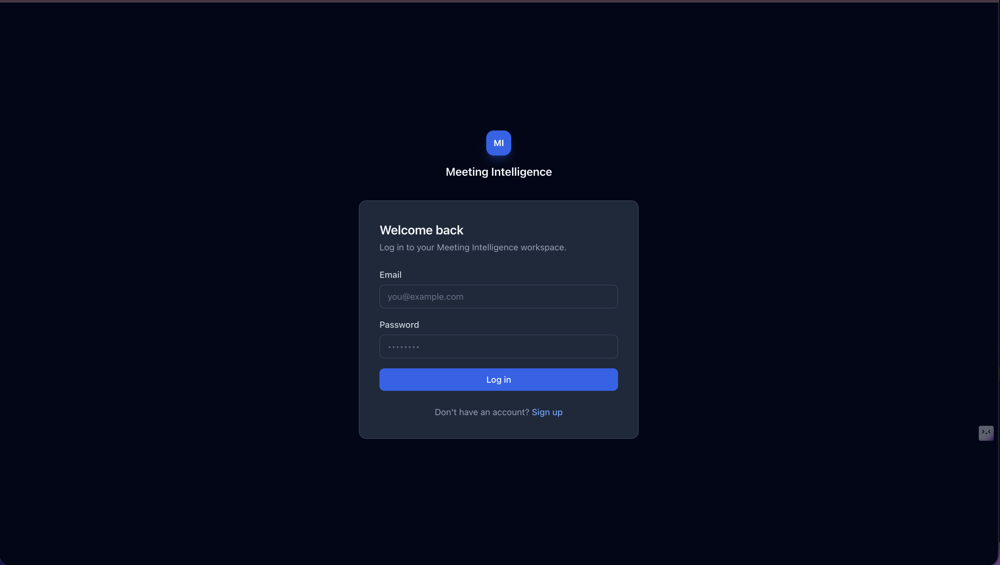
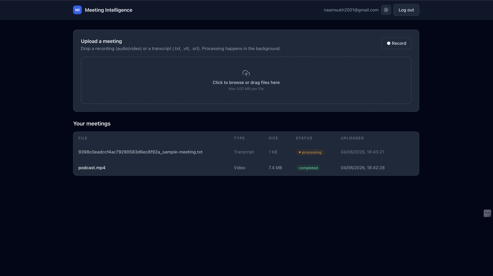
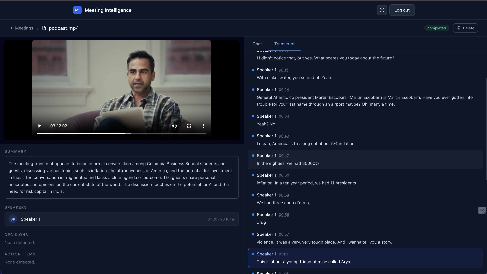
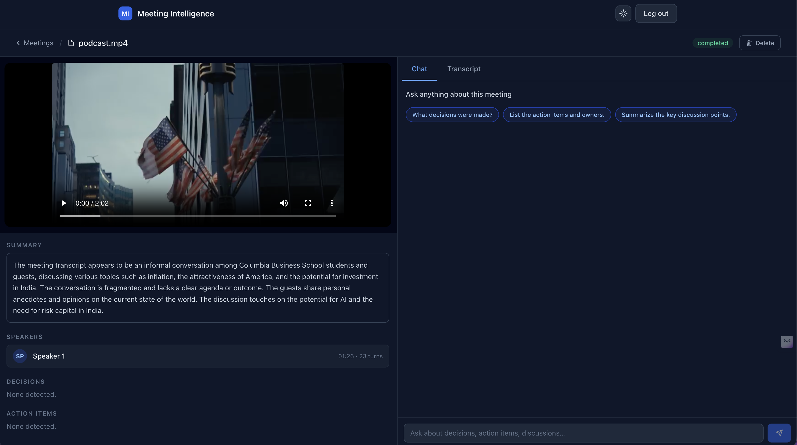
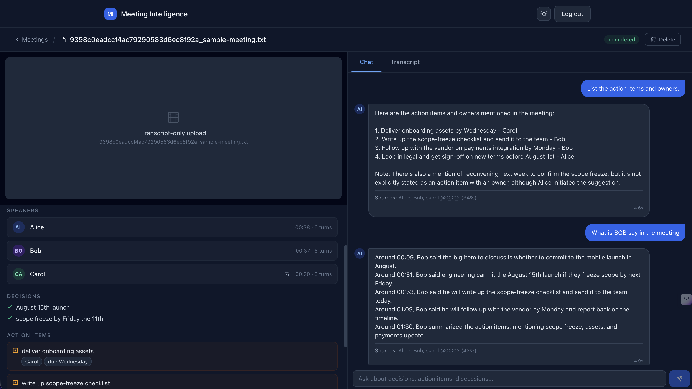

# Meeting Intelligence System

Upload meeting recordings or transcripts, and ask questions about what was
discussed, what was **decided**, and the **action items** — answered with RAG
(retrieval-augmented generation) grounded in the actual transcript.

---

## a. Quick setup

**Prerequisites:** Docker + Docker Compose, and API keys for Deepgram, Groq, and
OpenAI.

```bash
cp .env.example .env
# edit .env and set:
#   DEEPGRAM_API_KEY, GROQ_API_KEY, OPENAI_API_KEY
#   JWT_SECRET (e.g. `openssl rand -hex 32`)

docker compose up --build
```

- Frontend: <http://localhost:3000>
- Backend API + docs: <http://localhost:8000/docs>
- Health: <http://localhost:8000/health> · Metrics: <http://localhost:8000/metrics>

> **Port already in use?** Override the host ports (the browser talks to the
> backend directly, so keep `NEXT_PUBLIC_API_BASE` in sync):
> ```bash
> BACKEND_PORT=8080 FRONTEND_PORT=3001 \
>   NEXT_PUBLIC_API_BASE=http://localhost:8080 docker compose up --build
> ```

Sign up (anyone can), upload a transcript `.txt` or an audio/video file, watch
the row flip from **processing → completed**, then open it to chat and read the
transcript. A ready-to-use sample transcript lives in
[`docs/sample-meeting.txt`](docs/sample-meeting.txt).

**Running tests**

```bash
# Backend (DB-backed tests auto-skip if Postgres isn't reachable)
docker compose exec backend pytest

# Frontend
cd frontend && npm install && npm test
```

---

## Screenshots

| Sign up / Log in | Home — recording list |
|---|---|
|  |  |

| Recording — transcript view | Recording — chat view |
|---|---|
|  |  |

**Transcript sample**



---

## b. Architecture overview

See [`docs/architecture.md`](docs/architecture.md) for the full diagram. In short:

- **Next.js** UI → **FastAPI** API (JWT auth).
- Uploads are saved to a Docker volume and processed **asynchronously** by a
  **Celery** worker (Redis broker), so the UI never blocks.
- The worker transcribes (**Deepgram**, diarized) or parses the transcript,
  chunks it, embeds chunks (**OpenAI**), and stores vectors in **Postgres +
  pgvector**, then extracts a summary/decisions/action items (**Groq**).
- Chat runs **parallel hybrid retrieval** (FTS + semantic, both overlapping with
  the OpenAI embed call), asks **Groq** to answer **only** from that context,
  and reveals the answer in the frontend with a smooth word-by-word animation
  (rather than raw SSE streaming), returning cited timestamps/speakers.

Services: `db` (pgvector), `redis`, `backend`, `worker`, `frontend`.

---

## c. Productionizing, scaling & deploying on a hyperscaler

What this take-home does for simplicity, and what I'd change for production:

| Area | Here (take-home) | Production |
| --- | --- | --- |
| Media storage | Local `./data` volume | **S3/GCS** with presigned **direct-to-bucket** uploads; CDN for playback |
| Vector store | pgvector on the app DB | pgvector on managed Postgres (RDS/Cloud SQL) to start; **dedicated vector DB** (Qdrant / pgvector replica) past ~10⁶ vectors |
| Async jobs | Redis + Celery | Managed Redis / **SQS / Cloud Tasks**; autoscaled worker pool (ECS/Cloud Run/GKE), DLQ + retries with backoff |
| API | Single uvicorn | Stateless containers behind a load balancer, HPA autoscaling |
| Auth | JWT access token in localStorage | Short-lived access + **refresh tokens**, httpOnly cookies, rate limiting, lockout, optional SSO |
| Secrets | `.env` | Secrets Manager / Parameter Store / Vault |
| Observability | JSON logs, `/health`, `/metrics`, persisted retrieval traces | **OpenTelemetry** traces, Prometheus/Grafana, **LangSmith/Langfuse** for LLM traces & evals, alerting |
| Data | Single Postgres | Read replicas, PITR backups, migrations gated in CI/CD |
| Cost | Pay-per-call | Cache embeddings, batch, cap context, route by query class, usage quotas |

Deployment sketch (AWS): S3 (media) + CloudFront, RDS Postgres (pgvector),
ElastiCache Redis, ECS Fargate services for API + workers, ALB, Secrets Manager,
CloudWatch/OTel. Equivalents on GCP (Cloud Run + Cloud SQL + Memorystore + GCS)
or Azure.

---

## d. RAG / LLM approach & decisions

**Goal:** accurate, *grounded* answers about a single meeting, with citations and
low hallucination.

### Models & infra — considered vs chosen

| Choice | Considered | Chosen | Why |
| --- | --- | --- | --- |
| Transcription | Deepgram, Whisper | **Deepgram nova-3** | nova-3 has measurably better speaker diarization on mixed meeting audio vs nova-2 (all utterances returned as speaker 0 on real recordings with nova-2); MIME type is explicitly set per file extension so Deepgram demuxes MP4/MOV correctly |
| Answer LLM | OpenAI, local Llama, Groq | **Groq `llama-3.3-70b-versatile`** | Very low latency for chat UX; strong enough for grounded summarization/Q&A |
| Embeddings | local `bge-small`, Voyage, OpenAI | **OpenAI `text-embedding-3-small`** (1536-d) | Strong quality-per-cost, no model hosting; isolated behind one module to swap later |
| Vector DB | Qdrant, Chroma, pgvector | **pgvector** | One datastore; per-recording filter is an indexed WHERE; cascade-delete cleanup |
| Orchestration | custom, LlamaIndex, LangChain | **LangChain** | Standard LLM/message/prompt primitives without locking retrieval into a framework |

### Chunking

Meetings are conversational, so fixed-size character splitting cuts mid-sentence
and loses *who said what*. Instead (`backend/app/rag/chunking.py`) I group
consecutive utterances into ~600-token windows with a 1-utterance overlap, never
splitting an utterance, and keep each chunk's **time span + speakers** as
metadata. That metadata becomes the citations shown in the UI.

### Retrieval

**Hybrid search** combining two independent passes, fused with Reciprocal Rank
Fusion (RRF):

1. **Semantic pass** — embed the question, run cosine similarity in pgvector
   (`<=>`) filtered to the recording, take top `fetch_k` candidates.
2. **Full-text pass** — `ts_rank`/`plainto_tsquery` against a `tsvector`
   generated column (`GENERATED ALWAYS AS … STORED`) with a GIN index. Catches
   exact keyword matches (names, acronyms, numbers) that embeddings can miss.

Both passes run in parallel via a `ThreadPoolExecutor`: the FTS query is
submitted to a background thread immediately (it needs no embedding), while the
main thread calls the OpenAI embedding API concurrently. As soon as the vector
is ready the semantic DB query is dispatched to a second thread, so both DB
round-trips overlap and are off the latency critical path.

RRF merges both ranked lists without hand-tuned weights: chunks that rank
highly in either signal rise to the top; chunks appearing in both get a double
boost. The top-k results (default 5) are returned with cosine similarity scores
for display.

### Prompt & context management

A strict system prompt (`rag/prompts.py`) instructs the model to answer **only**
from the provided excerpts, cite timestamps/speakers, and refuse when context is
insufficient. Context is the concatenation of retrieved chunks; extraction is
capped in size to control cost.

### Guardrails

- **Input:** empty/length checks + simple prompt-injection heuristics.
- **Grounding:** if nothing clears the retrieval threshold, we **refuse**
  (`"I couldn't find that in this meeting."`) instead of guessing.
- **Output structure:** intelligence extraction is validated with Pydantic;
  malformed JSON degrades to empty lists rather than crashing.

### Quality controls

- Low temperature for deterministic-ish answers.
- Citations surfaced so users can verify every answer.
- `backend/tests/test_rag.py` asserts grounded-answer behavior, refusal on
  missing context, and injection blocking (LLM + retrieval mocked).

### Observability

Structured JSON logs with request IDs; per-stage timings (transcription,
chunking, embedding, retrieval, generation); every Q&A persists the retrieved
chunk ids + scores in `chat_messages.sources`; `/health` and `/metrics`
endpoints. Production extension: OpenTelemetry + LangSmith/Langfuse.

---

## e. Key technical decisions & why

- **Async-by-default uploads.** The API saves the file and returns instantly;
  Celery does the slow work. This matches the brief and keeps the UI responsive.
- **pgvector over a separate vector DB.** At take-home scale, a second datastore
  is operational overhead with no benefit; co-locating vectors with domain rows
  simplifies filtering and cleanup.
- **Unified `Utterance` shape.** Deepgram output and parsed transcripts both
  normalize to the same structure, so chunking/indexing has one code path.
- **Per-recording retrieval scoping.** Every query filters by `recording_id`, so
  answers can't leak across meetings (or users).
- **Thin provider wrappers.** Embeddings/LLM live behind small modules to keep
  swaps (e.g. to local models) cheap.
- **Hybrid retrieval over pure semantic search.** A `GENERATED ALWAYS AS`
  tsvector column keeps keyword search in sync with no app-side maintenance;
  RRF fusion avoids manual weight tuning while improving recall on exact terms
  (speaker names, dates, acronyms) that embeddings routinely miss.
- **Parallel retrieval.** FTS and the OpenAI embed call are dispatched
  concurrently so DB round-trips are off the chat latency critical path.
- **Smooth answer reveal instead of token-by-token streaming.** The frontend
  calls the non-streaming `/chat` endpoint and reveals the full answer
  word-by-word at a fixed pace. This removes SSE complexity and produces a
  consistent reading rhythm rather than the bursty feel of raw token streaming.

---

## f. Engineering standards followed (and ones skipped)

**Followed**

- Typed boundaries: Pydantic schemas + SQLAlchemy 2.0 typed models; TS on the FE.
- Clear module structure (`rag/`, `services/`, `routers/`), small focused files.
- Alembic migrations (incl. pgvector extension + ANN index).
- Tests at the layers that matter: parsing, chunking, RAG behavior, auth, upload
  flow, ownership; plus FE unit/component tests.
- Structured logging, health/metrics, ownership checks on every resource.
- Containerized end-to-end with one `docker compose up`.

**Skipped (acknowledged, given time)**

- Refresh tokens / token rotation; tokens live in localStorage.
- Exhaustive edge cases (huge files, exotic transcript formats, concurrent
  re-processing) — see *Limitations*.
- No end-to-end (Playwright) tests; no CI pipeline wired up.
- Single Groq model for all queries (no routing); no embedding cache.
- Fake streaming reveal (word-by-word) rather than real SSE token streaming — acceptable UX trade-off at this scale.

---

## g. How I used AI tools in development

I used **Claude Code** (Anthropic's CLI) throughout this project, primarily as a
fast pair programmer for implementation — not as a decision-maker.

**What I used it for**

- Boilerplate and scaffolding: Pydantic schemas, SQLAlchemy models, Alembic
  migration stubs, FastAPI router skeletons, Next.js component shells. These are
  high-volume, low-stakes — the patterns are standard and easy to verify by eye.
- Test stubs: generating the shape of pytest fixtures and Vitest tests against
  specs I wrote first, then filling in assertions myself.
- Frontend polish: Tailwind layout, dark-mode toggling, streaming SSE integration
  in the React components — things where I had a clear design in my head and
  wanted to move fast.
- Looking up exact API shapes (Deepgram diarization response structure,
  pgvector operator syntax, LangChain `ChatGroq` constructor) without breaking
  flow to read docs.

**What I designed and decided myself**

The parts where correctness isn't obvious from boilerplate:

- The chunking strategy: utterance-aware windows with speaker/time metadata
  preserved as retrieval metadata. A naive character-splitter cut mid-sentence;
  that experience drove the current design.
- Model selection trade-offs: Groq for latency, pgvector over a dedicated vector
  DB to avoid a second datastore at this scale, OpenAI embeddings over local
  models for quality without hosting.
- Prompt design: the strict system prompt that instructs the model to refuse when
  context is insufficient. I iterated on this manually until hallucination
  behaviour was acceptable.
- Security boundaries: auth middleware, JWT handling, ownership checks. I wrote
  these from scratch and reviewed them — these are the places where a
  confident-but-wrong AI answer causes actual harm.

**How I reviewed AI-generated code**

Small, targeted prompts per file or function. I read every generated line before
committing — not skimming for obvious errors but tracing the logic. If something
looked plausible but I couldn't explain *why* it was correct, I rewrote it. The
test suite gave me a fast feedback loop: generated code that broke an existing
test got investigated, not blindly fixed with another prompt.

**Do's and don'ts I settled on**

- *Do* use it for parsers, schema definitions, test stubs, component scaffolding,
  and exact-syntax lookups — high repetition, easy to verify.
- *Don't* trust it for auth logic, security-sensitive middleware, or architecture
  decisions without independent reasoning — it produces plausible-looking code
  that can have subtle flaws.
- *Don't* paste a large spec and ask for a full feature in one shot. Smaller
  scope per prompt = more predictable, reviewable output.

---

## h. What I'd do differently with more time

- **RAG eval harness** — the current tests assert *behaviour* (grounded answers,
  refusal when context is missing) but don't measure *quality* at scale. I'd add
  a golden Q/A set per meeting and track retrieval hit-rate and faithfulness
  scores so regressions are caught automatically, not manually noticed.
- **Cross-encoder re-ranker** — hybrid search + RRF improves recall, but a
  cross-encoder re-ranker (e.g. `ms-marco-MiniLM`) applied to the fused
  candidate set would further improve precision on ambiguous questions.
- **Semantic / topic-aware chunking** — the current utterance-window approach is
  already an improvement over fixed-character splitting, but grouping by topic
  shift would produce more coherent chunks for long meetings.
- **Cross-meeting search** — "ask across all my meetings" mode with a user-scoped
  index and two-stage retrieval (meeting filter → chunk filter).
- **WebSockets for processing status** — polling every 3 s works at this scale
  but a single WS connection per dashboard session would be cleaner.
- **Production plumbing**: direct-to-S3 uploads, httpOnly refresh tokens,
  CI/CD pipeline, OTel + Langfuse tracing so every LLM call is observable.
- **Rate limiting & quotas** on chat and upload endpoints — essential before any
  real multi-tenant deployment.

---

## i. Limitations & acknowledged edge cases

- RAG is **per-recording**; no cross-meeting retrieval yet.
- Very long meetings: chunking handles size, but retrieval quality could benefit
  from re-ranking; extraction context is truncated to control cost.
- Status updates use **polling**, not push.
- Token stored in localStorage (XSS exposure) — fine for the assignment, not prod.
- Deepgram diarization works on voice characteristics from a single mixed audio
  track. It produces distinct `Speaker 1…N` labels when voices are acoustically
  different; it collapses to one speaker when they are too similar, the clip is
  very short, or the audio is heavily compressed. Zoom/Teams cloud recordings
  (one mixed MP4) are supported; per-participant separate tracks are not needed
  but would improve accuracy.
- The IVFFlat index is tuned for small data; `lists`/`probes` would be tuned at
  scale.

---

## Project layout

```
backend/   FastAPI app, Celery worker, RAG package, services, tests, Alembic
frontend/  Next.js (App Router) UI + components + Vitest tests
docs/       architecture diagram, sample transcript, screenshots
docker-compose.yml   db (pgvector) · redis · backend · worker · frontend
```

## Bonus: voice-to-transcript

The dashboard has a **● Record** button (`MicRecorder`) that captures mic audio
in the browser and uploads it through the same pipeline, where Deepgram
transcribes it. Live streaming transcription is noted as a further stretch.
